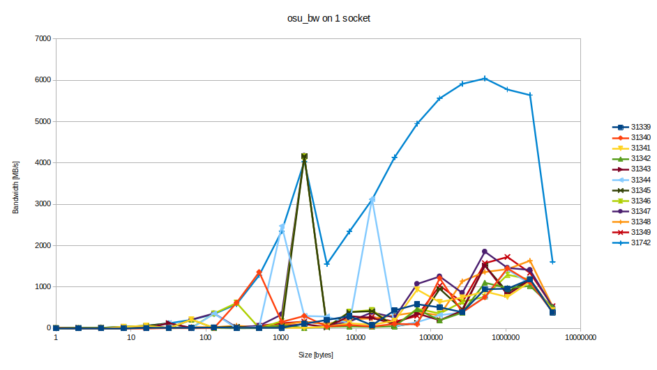
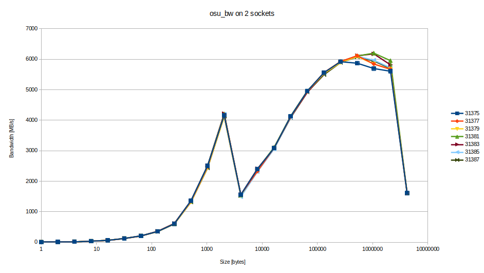
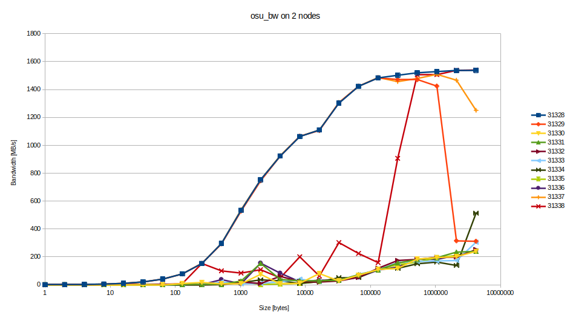
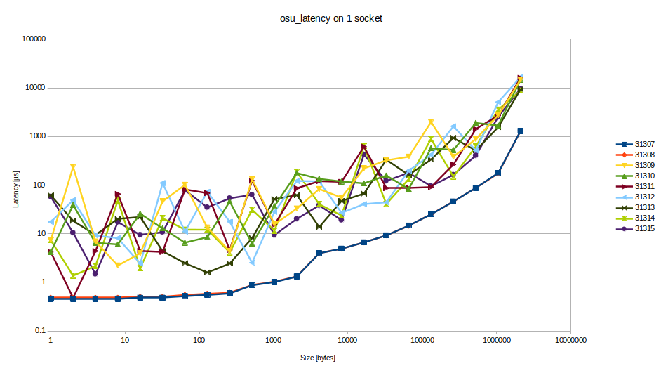
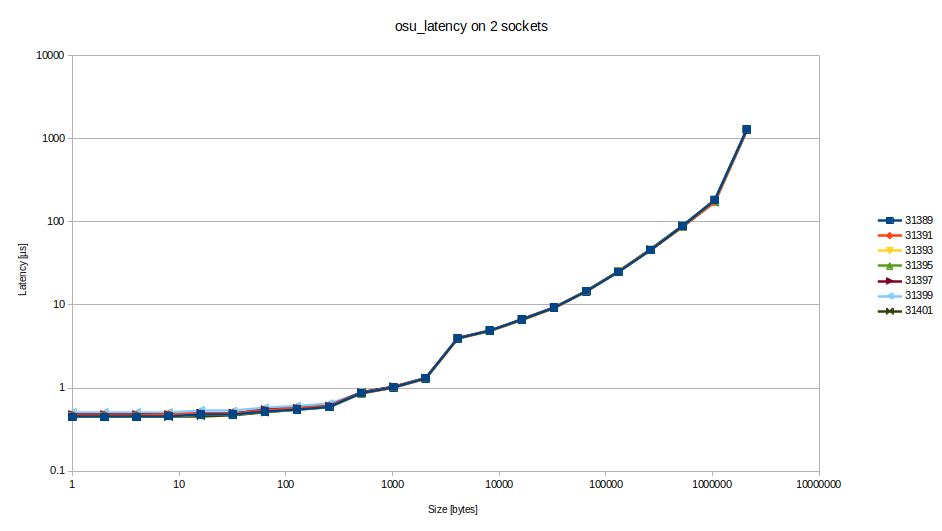
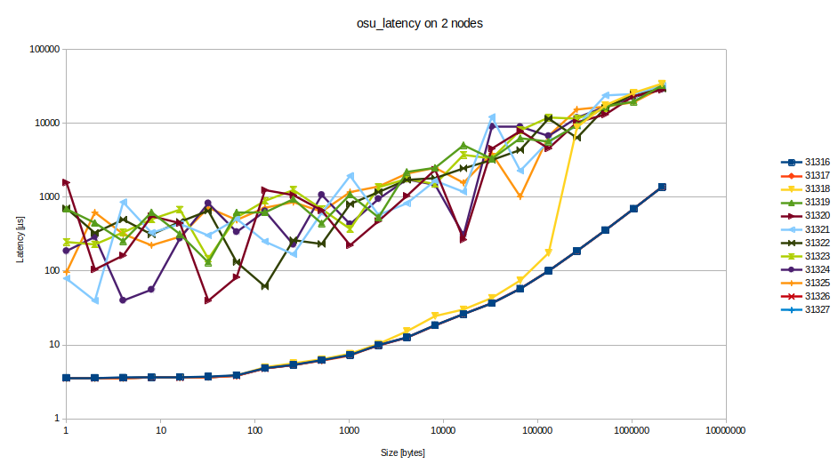

# Assignment 1, due October 16th 2019

The goal of this assignment is to get you acquainted with working on a distributed memory cluster as well as obtaining, illustrating, and interpreting measurement data.

## Exercise 2

This exercise consists in running an MPI microbenchmark in order to examine the impact of HPC topologies on performance.

### Description

The OSU Micro-Benchmarks suite holds multiple benchmarks that measure low-level performance properties such as latency and bandwidth between MPI ranks. Specifically, for this exercise, we are interested in the *point-to-point* ones, which exchange messages between 2 MPI ranks.

### Tasks

- Download and build the OSU Micro-Benchmarks available at http://mvapich.cse.ohio-state.edu/download/mvapich/osu-micro-benchmarks-5.6.2.tar.gz. You can also use available binaries on LCC2 at `/scratch/c703429/osu-benchmark/libexec/osu-micro-benchmarks/mpi/pt2pt` (built with `openmpi/4.0.1`). Note: If you build yourself, do not forget to set the compiler parameters for `configure`, e.g. `./configure CC=mpicc CXX=mpic++ ...`
- After building, submit SGE jobs that run the `osu_latency` and `osu_bw` executables.
- Create a table and figures that illustrate the measured data and study them. What effects can you observe?
- Modify your experiment such that the 2 MPI ranks are placed on
    - different cores of the same socket,
    - different sockets of the same node, and
    - different nodes.
- Amend your table and figures to include these additional measurements. What effects can you observe? How can you verify rank placement without looking at performance?
- How stable are the measurements when running the experiments multiple times?

#### osu_bw:
Executes bandwidth tests between two ranks with increasing message size

see plots osu_bw_1_socket.png, osu_bw_2_sockets.png, osu_bw_2_nodes.png (the legend shows the job_ID)

The bandwidth increases exponentially with the package size and saturates on a certain point at approx. 100kB chunks. Also there are two abrupt decreases in bandwidth at the step to the 4kB packages and to the 4GB packages. This may be explainable by a change in the message algorithm of mpi send/receive dependent on the message size.

#### osu_latency:
Executes latency benchmarks of messages between two ranks with increasing message size.

see plots osu_latency_1_socket.png,  osu_latency_2_sockets.png, osu_latency_2_nodes.png (the legend shows the job_ID)

The latency shows an exponential grow in respect to the message size. Here also are some slight increases in latency visible which may be caused by algorithm changes of the underlying framework. Those occur at 128B, 512B, 4kB and 4GB. Also this may be caused by packet sizes of the underlying transport protocol.

#### same socket vs. different sockets vs. different nodes

The LCC2 is built of nodes which contain two CPU sockets where each CPU has 4 cores.

The jobs for same sockets are configured with the option **-pe openmpi-2perhost 2** which schedule two free cores. With the precondition of in sequence scheduled processes and no other running jobs, each job is scheduled to two neghboring cores (even number of processes per job).

to force the job on two different sockets a second job was scheduled immediately before a job configured with option **-pe openmpi-fillup 2** which keeps the first three cores busy, so the job is scheduled to the fourth core of the first socket and the first core of the second socket.

**-pe openmpi-1perhost 2** causes to use only one process per node, so the two ranks are distributed over the internal network of the cluster.

In terms of latency and bandwidth, the jobs on the same socket or on different sockets are indistingushable. Either the bus between the sockets is as fast as the interconnection of the cores inside a socket, or the cores are not filled up with processes in sequence. Thus, the trick to keep some cores busy to get different sockets won't work.

As expected, in case of different nodes, the bandwidth is lowered and the latency increased, compared to the benchmarks within one node.

The results are almost deterministic if only a single test runs at a time. This can be observed in the plots **osu_bw_2_sockets.png** and **osu_latency_2_sockets.png**. On the other hand, when I scheduled multiple instances of the same benchmark, the results became highly unstable combined with a dramatic performance decrease (by up to a factor 1000!). So, there seems to be a mutual influence between independent jobs.

