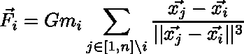
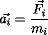
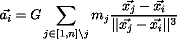
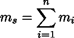
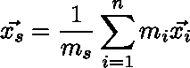
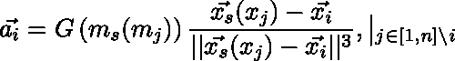
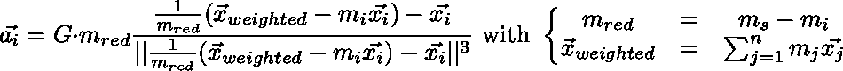

# Assignment 5

## Exercise 2

### Description

N-body simulations form a large class of scientific applications, as they are used in research ranging from astrophysics to molecular dynamics. At their core, they model and simulate the interaction of moving particles in physical space. For this assignment, the specific n-body setting relates to astrophysics, where the mutual graviational effect of stars is investigated. Each particle has several properties which include at least
- position,
- velocity, and
- mass.

For each timestep (you can assume `dt = 1`), particles must be moved by first computing the force excerted on them according to the [Newtonian equation for gravity](https://en.wikipedia.org/wiki/Newton%27s_law_of_universal_gravitation), `force = G * (mass_1 * mass_2) / radius^2` where `G` is the gravitational constant (and can be assumed as `G = 1` for simplicity). Second, using the computed force on a particle, its position and velocity can be updated via `velocity = velocity + force / mass` and `position = position + velocity`.

### Tasks
- Study the nature of the problem in Exercise 1, focusing on its characteristics with regard to optimization and parallelization.
- What optimization methods can you come up with in order to improve the performance of Exercise 1?
- What parallelization strategies would you consider for Exercise 1 and why?

The N-body simulation forms a problem, where each element "body" depends to each other element. Thus, a simple implementation contains two nested loops in the form

```
for i = 0 to n
    for j = 0 to n
        <process calculations>
    done
done
```
... which executes with O(n²).

The simulation calculates gravity forces. So, the superposition principle for Newtonian forces _**f** = **f1** + **f2** + ... + **fn**_ applies, where **f** and **f_** are vectors. These forces can be computed step-wise and in random order as follows:



__Equation 1:__ force on particle _i_ at position _x_i_



__Equation 2:__ acceleration _a_i_ of particle _i_ depending on force _F_i_

Equation 2 inserted in equation 1 gives:



__Equation 3:__ acceleration _a_i_ of particle _i_

The superposition theorem states: multiple particles _x_i_ with mass _m_i_ act like one particle with summated mass at its mass point



__Equation 4:__ mass _m_s_ of superposition of all particles effective at _x_s_



__Equation 5:__ coordinates of mass center _x_s_


Now the equations 4 and 5 can be inserted into equation 3. Since only two masses remain, the equation can be written as:



__Equation 6:__ acceleration _a_i_ of particle _i_ as expression of a macroscopic body with its mass point at _x_s_ attracting _x_i_, where _m_s(m_j)_ is the mass at the center of gravity _x_s(x_j)_ of all points except _x_i_.

Afterwards the equation can be rewritten to:



__Equation 7:__ acceleration in terms of mass and point of gravity of all particles

which gives a blueprint for a parallelizable algorithm. The order in which the particles are processed does not matter, so it is not necessary to sort them into a cartesian grid.


### Algorithm:
The idea behind the algorithm is, to split the domain into several ranks, where each rank processes the acceleration and new position for all particles within their subdomain. Afterwards all ranks distribute the mass and center of gravity of the whole subdomain. Each particle in a subdomain is accelerated accordung to the masses of all other ranks.

```
particle: (x, v, m) with x = (x_x, x_y), v = (v_x, v_y)
n particles
r ranks
k = n/m praticles per rank
G gravity constant
dt timestep

m = 0
x_weighted = (0, 0)

for (p in particles of rank)
do
    m += p.m
    x_weighted += p.m * p.x
done

send x_weighted and m to all ranks
receive {x[1], ..., x[n]} and {m[1], ..., m[n]} from other ranks
        (where x[i] = x_weighted and m[i] = m for the i-th rank)

x_w_tot = 0
m_tot = 0
for (i = 1 to r)
do
    x_w_tot += x[i]
    m_tot += m[i]
done
--> for many ranks, a tree structure to collect and sum up x and m may have an advantage,
    distribute then x_w_tot and m_tot to all ranks

for (p in particles of rank)
do
    m_red = (m_tot - p.m)
    temp = (x_w_tot - p.x*p.m)/m_red - p.x
    a = G * m_red * temp / ||temp||^3
    p.v += a * dt
    p.x += p.v * dt
done
```

#### Addendum:
Well, this algorithm is quite messed up, cause it is based on the wrong assumtion, that the system behaves like a two particle system with all but one particles represented by their center of gravity, which does not hold.
The center of mass can be exploited for clusters of particles with some distance to a particle. So, an implementation which sorts particles to clusters and clusters to super-clusters in a tree would be possible. A quad-tree over a euclidian grid or some kind of graph would be possible implementations.

